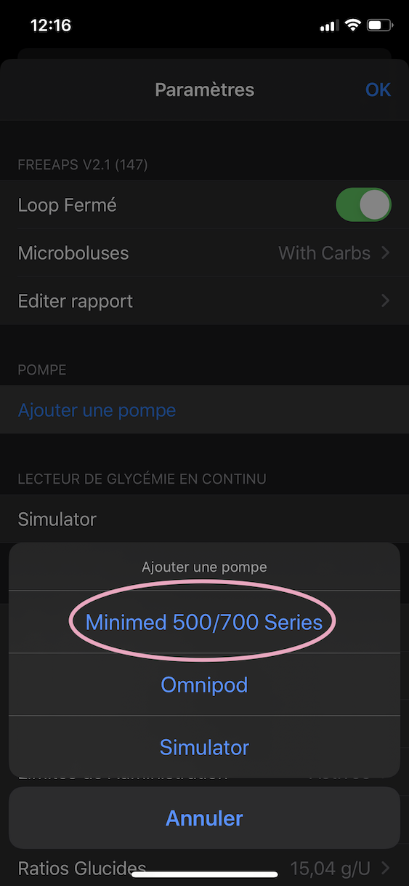
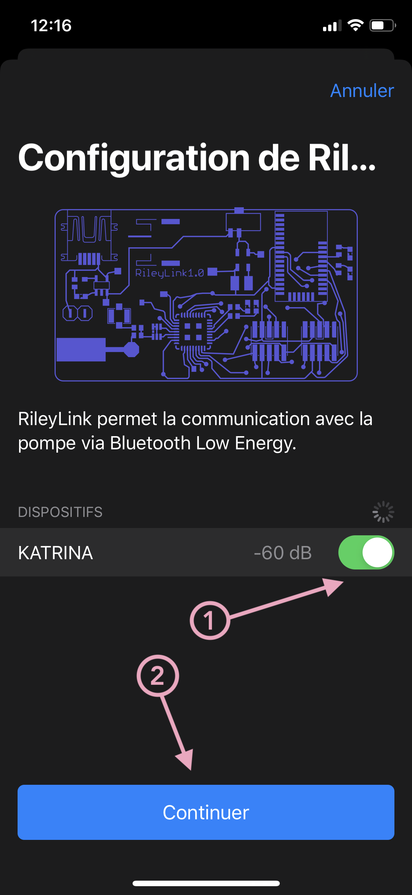

# Utilisateurs Medtronic

Votre Loop ne montre pas grand chose initialement jusqu'à ce qu'on lui donne quelques réglages de base. La première étape va consister à ajouter une pompe à Loop. Si vous utilisez la pompe Medtronic, vous pouvez continuer sur cette page. Si, par contre, vous utilisez une pompe Omnipod, veuillez continuer sur [cette page](../pompe-omnipod).

## Préparer la pompe Medtronic

>
> Avant de commencer ce processus, il y a plusieurs étapes à effectuer dans votre pompe Medtronic avant de procéder à la mise en place dans Loop. **N'IGNOREZ PAS CES ÉTAPES, SINON LOOP NE FONCTIONNERA PAS.**
>

1. Sous l'option `Schemas` dans le menu basal, selectionnez `Non`. Ceci forcera Loop d'utiliser vos débits "standards".

2. Vérifiez que vos débits sont à jour et précis. Loop téléchargera automatiquement vos débits programmés dans la pompe quand vous la reliez à l'application. **Si vous changez vos débits de basal plus tard... veillez à le faire *dans l'application* et non pas sur la pompe, et utilisez l'application pour les enregistrez dans la pompe. Si vous changez vos débits directement sur la pompe, Loop ne les prendra pas en compte automatiquement et vous entraînerez un décalage entre l'application et la pompe.

3. Sous l'option `Type basal temp` dans le menu basal, selectionnez `Débit d'insuline (U/H)`. N'UTILIEZ PAS `POURCENTAGE BASAL (%)`. Ce dernier est incomptable avec Loop, et votre boucle ne fonctionnera pas.

4. Vérifiez que votre débit basal maximum et votre bolus maximum (réglages dans les menus respectifs de la pompe) sont raisonnable par rapport à vos besoins d'insuline. Pour les nouveaux utilisateurs, un débit maximum équivaut 2 à 4 fois votre débit le plus important (par exemple, si votre débit par heure le plus important est 1,0U, votre débit maximum serait aux alentours de 2 à 4 U/H). Vous pouvez ajuster cette valeur plus tard une fois que vous êtes plus à l'aise avec Loop.

5. Sous l'option `Options télécommande` dans le menu fonctions, selectionnez `Oui` et entrez n'importe quel numéro (000000 fonctionnera).

6. Annulez tout bolus duo ou carré en cours. Loop ne fonctionne pas si ce type de bolus est en cours.

7. Vérifiez que tous vos réglages de votre pompe, tel que l'assistant bolus, sont à jour. Si vous devez arrêter Loop, votre pompe sera alors à jour pour continuer sans.

## Sélectionner le type de pompe

Commençons par cliquer sur le bouton de réglages de Loop dans la barre d'outils en bas de votre app Loop. Il ressemble à un petit pignon. Sur l'écran des réglages qui s'ouvre, cliquer sur `Ajouter une pompe` et sélectioner l'option **Medtonic** qui apparaît.

## Relier la pompe
Maintenant vous devez suivre quelques propositions pour relier votre pompe Medtronic à Loop :

1. Vérifiez que votre RileyLink est allumé et à proximité, puis vous allez voir le nom d'un RileyLink apparaître sur l'écran. Selectionnez-le via le bouton à droite.

2. Ajoutez la région de votre pompe, sa couleur, et son numéro de série.

3. Cliquez sur `Continuer` pour terminer.

>
> **Pour les utilisateurs des pompes Medtronic x23 et x54 :**
> Pour les utilisateurs ayant une pompe x23 ou x54, il y a un paquet d'information spécifique à ces pompes qui s'appelle des messages MySentry. Si vous n'avez jamais mis en place cette fonctionnalité de votre pompe, vous pourriez voir un écran qui s'appelle "Pump Broadcasts" à ce moment là dans la configuration de votre pompe.
> Veuillez suivre les instructions qui s'affichent. Une fois terminé, selectionnez `Continuer` dans Loop pour finir la configuration.
> Cette partie ne concernent pas les pompes Medtronic x15 ou x22, seulement les x23 et x54.
>

Maintenant que votre pompe est reliée à Loop, vous devez :

1. Changer l'heure de votre pompe *dans l'application-même*

2. Téléchargez vos débits de basal dans Loop, ainsi que les limites d'administration (débit et bolus maximum)

3. Selectionnez le type de pile que vous utilisez (alkaline ou lithium)

4. Laissez la source de donénes préférée comme `Historique des événements`

`Historique des événements` doit ***impérativement*** être selectionné pour que Nightscout reçoive les débits temporaires, glucides, et boluses de Loop. `Historique des événements` doit aussi être selectionné pour que l'amorce de la canule ne soit pas prise en compte dans l'insuline active.

## Prochaine étape : ajouter un CGM

Bravo ! Vous avez ajouté votre POD à l'app Loop. Maintenant, cliquer sur le bouton `Done` dans le coin supérieur droit dans vos réglages de pompe pour retourner sur les réglages de Loop. La prochaine étape est d'[ajouter un CGM](#) à votre app Loop. Après tout, sans données CGM, votre Loop ne loopera pas.
