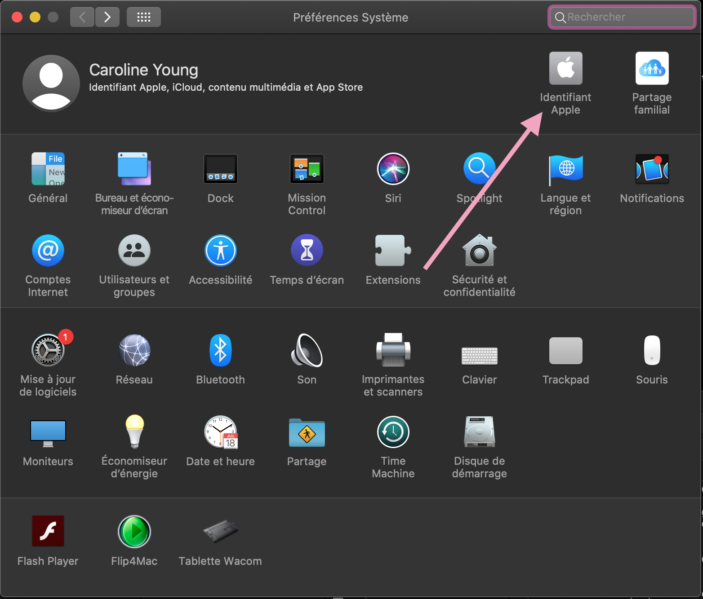

#  Télécharger le code de Loop 
!!! note "Temps estimé" 
    * 1 minute pour télécharger Loop 
    * 10 minutes pour lire cette page 
 
!!! warning "Résumé" 
    * La branche principale de Loop a été récemment mise à jour avec Loop 2.2 
    * Toutes les branches de Loop prennent en charge les utilisateurs de pompes Medtronic *et* Omnipod 
 
!!! danger "FAQ" 
    * **"Qu'est-ce qu'une branche ?"** C'est une excellente question. Nous avons une [page de FAQ](https://loopkit.github.io/loopdocs/faqs/branch-faqs/) sur les branches. 
    * **"Comment puis-je savoir quelle version j'ai téléchargé si je ne suis pas sûr(e) ?"** Le nom du dossier Loop vous donnera une indication de la branche que vous avez téléchargée. Le nom du dossier sera au format `Loop-nom-de-la-branche`. 
    * **"Quand dois-je télécharger du nouveau code ?"** Chaque fois que vous voudrez mettre à jour votre application Loop pour obtenir de nouvelles fonctionnalités, il vous suffira de télécharger à nouveau le code en cliquant sur les liens ci-dessous. Les liens renvoient toujours à la version la plus récente de chacune des branches. Il est conseillé de supprimer vos anciens téléchargements avant d'en faire un nouveau, afin d'éviter toute confusion. 
 
## Choisissez une branche à télécharger 
Vous devrez télécharger le code de Loop pour pouvoir créer l'application sur votre ordinateur. Différentes versions du code Loop sont stockées dans des "branches". Vous avez le choix entre plusieurs branches à partir desquelles vous pouvez construire l'application... vous en choisirez une à télécharger. Vous ne savez pas ce qu'est une branche ou ce qu'elle signifie ? Vous pouvez lire plus de détails sur [la page FAQ sur les branches](https://loopkit.github.io/loopdocs/faqs/branch-faqs/). 
 
Branche `master` versus `dev` ? En général, la plupart des utilisateurs devraient s'en tenir à l'utilisation de la branche `master`. Les fonctionnalités expérimentales et les nouveaux changements de code seront d'abord testés dans la branche dev, donc cette branche risque d'avoir des régressions et bugs périodiques au fur et à mesure du développement des nouvelles fonctionnalités. Si vous n'êtes pas développeur ou débogueur, restez dans la branche `master`. Cliquez sur ***un seul*** des liens ci-dessous pour télécharger le code de Loop... et pour 99% des utilisateurs, c'est sur `master` qu'il faut cliquer. 
 
[Loop : branche MASTER](https://github.com/LoopKit/Loop/archive/master.zip) 

[Loop : branche DEV](https://github.com/LoopKit/Loop/archive/dev.zip) 
 
## Stockez et nommez votre téléchargement correctement 
La meilleure pratique consiste à laisser votre code de Loop dans votre dossier de Téléchargements. Si vous stockez votre code dans un dossier différent de celui des téléchargements (comme votre dossier Documents ou sur votre Bureau), assurez-vous que le dossier spécifié n'est pas un lecteur iCloud. Si vous stockez votre code dans un dossier de lecteur iCloud, Loop ne pourra pas se construire correctement. Comment savoir si un dossier est un lecteur iCloud ? Vérifiez vos préférences système. Si vous Préférences Système pour iCloud sont définies comme indiqué ci-dessous, vos dossiers Documents et Bureau sont des lecteurs iCloud et NE SONT DONC PAS des endroits appropriés pour enregistrer votre téléchargement de Loop.  
 
 
 
 
 
En fonction de votre navigateur et de vos paramètres, votre téléchargement Loop peut ou non se décompresser automatiquement. S'il ne se décompresse pas automatiquement, vous pouvez cliquer avec le bouton droit de la souris sur le fichier zip et choisir "Ouvrir avec..." l'utilitaire d'archivage. Cela créera un dossier bleu appelé `Loop-master`. CEPENDANT, si vous avez déjà un dossier Loop-master existant d'un téléchargement précédent, le nom du prochain téléchargement sera quelque chose comme `Loop-master (1)`.  
 
### [Cliquez ici pour voir la page d'origine](https://loopkit.github.io/loopdocs/build/step13/) 
