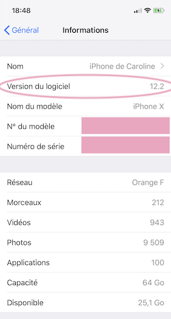

# iPhone ou iPod Touch
!!! note "Temps estimé"
    * 5 minutes, si vous avez déjà iOS 12.4 ou version ultérieure
    * 20 minutes, si vous devez mettre à jour votre appareil pour avoir iOS 12.4 ou version ultérieur
    * 10 minutes, si vous devez commander un appareil Apple

!!! warning "Résumé"
    * Vérifiez votre version iOS pour être sûr(e) que vous avez 12.4 au minimum
    * N'utilisez pas les betas d'iOS
    * Si vous utilisez Dexcom, vous devez avoir l'application Dexcom installé sur le même appareil que vous utiliserez pour Loop pour pouvoir looper hors Internet

!!! danger "FAQ"
    * **"Puis-je utiliser Android ?"** Non.
    * **"Mais pourquoi pas ?"** Parce que le code pour Loop est fait dans le langage Apple Swift, qui n'est compatible qu'avec les appareils Apple. Loop a besoin également de l'application Apple Santé pour pouvoir fonctionner, et Andoid n'a pas d'équivalent natif.
    * **"Puis-je utiliser un iPad ?"** Non. Les iPads n'ont pas l'application Santé, ce qui est obligatoire pour le fonctionnement de Loop.
    * **"Dois-je payer un abonnement mobile pour l'iPhone ?"** Non. Loop fonctionne hors ligne. Cependant, vous n'allez pas avoir Dexcom Share ni Nightscout sans données mobiles quand vous êtes hors zone WiFi. Donc Loop fonctionnera, mais si vous installez Loop pour un proche vous pourrez pas lui suivre sans Internet.

Loop fonctionnera sur tout iPhone ou iPod Touch ayant iOS 12.4 ou plus récent. Donc, les périphériques compatibles sont :

* iPhone 11, 11 Pro, 11 Pro Max

* iPhone X, XS, XR, XS Max

* Phone 8, 8+

* iPhone 7, 7+

* iPhone 6, 6+, 6s, 6s+

* iPhone SE

* iPhone 5s

* iPod Touch, 6 ou version ultérieure

## Mise à jour iOS 13
Le 19 septebmre 2019, Apple a publié iOS 13. Les iPhones 5s, 6 et 6+ n'ont pas la possibilité d'être mise à jour pour iOS 13. Ceci ne pose pas de problème dans l'immédiat, vous pouvez toujours monter Loop tant que vous avez iOS 12.4 minimum. Cependant, il y aura des changements dans Loop qui vont requérir iOS 13. Il n'y a pas de date butoir pour ces mises à jour, mais sachez qu'un jour ça tombera. 

Entretemps, vous pouvez continuer à utiliser iOS 12.4 (ou version ultérieure) sans souci. La mise à jour à iOS 13+ n'est pas obligatoire pour Loop. Votre application Loop fonctionnera si vous mettez à jour votre téléphone, une mise à jour iOS ne requiert pas une mise à jour de Loop. Il continuera à fonctionner sans mise à jour iOS 13+ également.

## Loop fonctionne-t-il sur iPad ?
Non. Loop requiert que l’application Santé soit présente sur le périphérique pour sauvegarder les données d’insuline, taux de glucose, et données de glucides pour looper. Donc, Loop ne fonctionne pas sur iPad car l'iPad n'a pas de capacité de Santé.

## Loop fonctionne-t-il sur Androïde ?
Non. Loop est programmé en Swift, un langage informatique pour iOS, qui requiert l'intégration de Santé (voir ci-dessus).

## Trouvez sa version iOS
Allez dans les réglages de votre iPhone, puis dans `général`, puis `informations`. Là vous trouverez l'iOS, marqué sous "version du logiciel".

### [Cliquez ici pour voir la page d'origine](https://loopkit.github.io/loopdocs/build/step2/)
