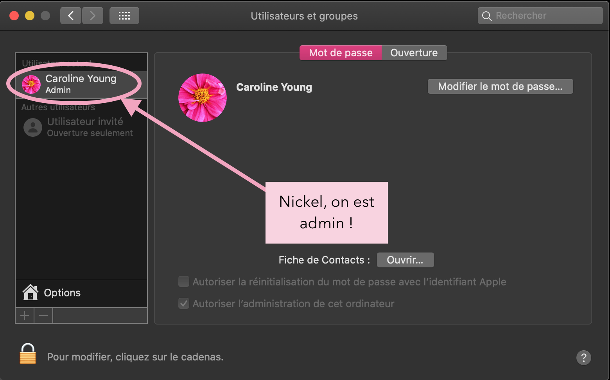

# Installer Homebrew

!!! note "Temps estimé"
    * 10 à 15 minutes si vous connaissez le mot de passe de votre ordinateur
    * 35 minutes sinon, ou si vous avez besoin de deviner / chercher 

!!! warning "Résumé"
    * Installez Homebrew en copiant et collant tout simplement une longue ligne de code dans la fenêtre Terminal 

!!! danger "FAQ"
    * **"Que faire si je n’obtiens pas le message “installation successful” (installation réussie) ?"** Si vous n’obtenez pas le message installation réussie, recommencez le copier/coller la ligne de code dans la fenêtre Terminal attentivement.  Et si vous ne parvenez toujours pas à installer Homebrew, la construction de Loop échouera aussi. Vous ne pouvez donc pas simplement vous affranchir de cette étape. Notez que la cause d’erreurs la plus fréquente est le fait de ne pas copier la totalité de la ligne de code, et notamment le `“` final. Par ailleurs, cela demande d’utiliser un compte utilisateur possédant les droits d’admin puisque le processus installe un programme sur l’ordinateur cible. 

Homebrew est un logiciel qui nous permet d’installer les packages nécessaires pour monter Loop. Avant d'installer Homebrew, nous devons vérifier une chose... que le compte sur l'ordinateur que vous utilisez pour construire Loop ait les droits d'administrateur sur l'ordinateur. Comment pouvez-vous le savoir ? Allez dans les préférences système de votre ordinateur, ouvrez la section Utilisateurs et groupes. Si le compte que vous utilisez ne porte pas la mention "Admin" sous votre nom, vous devez cliquer sur le cadenas et le remplacer par un compte Admin avant de continuer. Si vous utilisez un ordinateur professionnel, il se peut que vous n'ayez pas les droits d'administrateur sur cet ordinateur... sachez donc que vous pouvez avoir des restrictions sur les ordinateurs appartenant à votre société.

Remarque : si vous êtes (1) un expert en informatique et (2) que vous avez déjà installé Homebrew sur un autre compte d'utilisateur sur l'ordinateur, veuillez utiliser ce compte sur l'ordinateur pour construire Loop. Ou bien, supprimez Homebrew de ce compte d'utilisateur et installez-le sur votre compte. Homebrew est un peu particulier comme ça.

Bon, maintenant que le compte d'utilisateur est confirmé, ouvrons l'application Terminal sur votre ordinateur. Elle se trouve dans votre dossier Applications. Regardez dans le sous-dossier Utilitaires... l'application Terminal s'y trouve comme le montre la capture d'écran ci-dessous.

L’application Terminal semble vraiment anodine quand vous l’ouvrez. C’est normal. Copiez puis collez le texte ci-dessous dans la fenêtre Terminal. Cliquez sur la touche « retour » après avoir collé le texte.

`/usr/bin/ruby -e "$(curl -fsSL https://raw.githubusercontent.com/Homebrew/install/master/install)"`

Il y aura une fenêtre qui vous demandera si vous voulez continuer. Cliquez sur la touche « retour » pour continuez, puis l’ordinateur vous demandera le mot de passe de votre ordinateur.

***Ne vous inquiétez pas quand vous ne voyez pas votre mot de passe pendant que vous le tapez. Ceci est normal. L’application Terminal ne montre pas des frappes quand on entre un mot de passe. Si vous croyez avoir fait une erreur, cliquez sur la touche supprimer plusieurs fois puis recommencer.***

Attendez pendant que Terminal fait son boulot. Vous allez voir des informations et données s’afficher puis Terminal va arrêter pendant un moment. Après un peu de temps, vous allez voir quelque chose qui dit « installation successful » et Terminal sera prêt à continuer.

Vous pouvez fermer l’application Terminal maintenant. On a terminé avec. Vous ne devez pas refaire ce processus dans l’avenir. 

## Désinstaller Homebrew
Si vous rencontrez un problème avec l'installation de Homebrew et que vous voulez le supprimer pour recommencer, la commande de désinstallation est :

`ruby -e "$(curl -fsSL https://raw.githubusercontent.com/Homebrew/install/master/uninstall)"`

Copiez et collez toute cette ligne dans l'application Terminal. Ensuite, vous pouvez réessayer l'installation de Homebrew en utilisant la commande d'installation metionnée plus haut dans cette page.

### Prochaine étape : [Installer Xcode](https://cyoung1024.github.io/guide-loop-fr/etape8)

### [Cliquez ici pour voir la page d’origine](https://loopkit.github.io/loopdocs/build/step7/)

