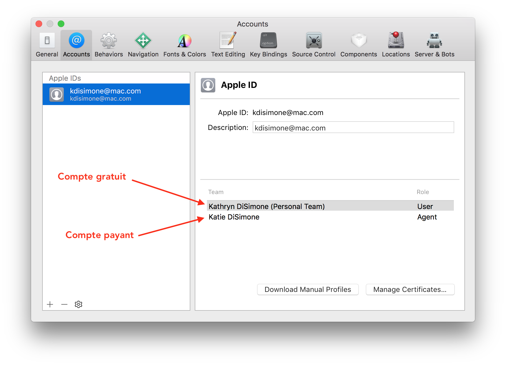

#  Préférences de Xcode 
 
 
!!! note "Temps estimé" 
    * Environ 10 à 15 minutes pour installer les Command Line Tools 
    * 5 minutes pour ajouter votre Apple ID, pourvu que vous vous souveniez de votre mot de passe 
 
 
!!! warning "Résumé" 
 
 
!!! danger "FAQ" 
 
 
Maintenant que vous vous êtes inscrit dans le programme de développeur Apple de l'étape 6 et que vous avez intallé Xcode dans l'étape 8, on doit entrer votre compte développeur dans Xcode. 

Ouvrez Xcode depuis le dossier Applications de votre oridnateur. 

## Command Line Tools 
Il y aura peut-être un petit délai la première fois que vous ouvrez Xcode, car il doit installer les outils dont il a besoin. Ne fermez pas cette fenêtre... on a besoin de ces outils, appelés Command Line Tools. Petite astuce : quand l'installation des Command Line Tools est terminée et la fenêtre d'installation ferme, vérifiez que l'installation a terminé avec succès. Ouvrez les préférences de Xcode en cliquant sur le mot `Xcode` en haut à gauche de votre écran, puis sélectionnez `Preferences` dans le menu qui s'ouvre. Quand vous sélectionnez `Locations`, vous verrez le menu des Command Line Tools. Vérifiez que Xcode 11.3 (ou version ultérieure) est sélectionné. 
 
 
 
## Ajouter l'Apple ID 
Allez dans la fenêtre `Preferences` de Xcode comme nous avons fait pour les Command Line Tools, et cliquez sur l'onglet `Accounts`. Ensuite, appouyez sur le `+` dans le coin inférieur gauche pour ajouter un compte Apple ID. 

 
 
Si vous souhaitez utiliser un compte développeur gratuit, il vous suffit d'entrer votre Apple ID dans cette section et Xcode inscrira automatiquement votre Apple ID dans le programme de développement gratuit. Si vous vous êtes déjà inscrit(e) avec un compte payant et que vous avez la confirmation que votre compte a été activé, entez l'Apple ID du compte payant ici. La capture d'écran ci-dessous montre l'étiquetage des Team Names ("noms d'équipe") selon qu'ils proviennent d'un compte gratuit ou d'un compte payant. Les comptes gratuits auront `Personal Team` après le nom. 

 
  
Vous avez maintenant terminé la confiuration de Xcode. Vous n'aurez pas besoin de refaire les étapes de configuration du compte lors des prochaines versions ou mises à jour de votre application Loop. Xcode se souviendra de ces paramètres. 

### [Cliquez ici pour voir la page d'origine](https://loopkit.github.io/loopdocs/build/step9/) 
