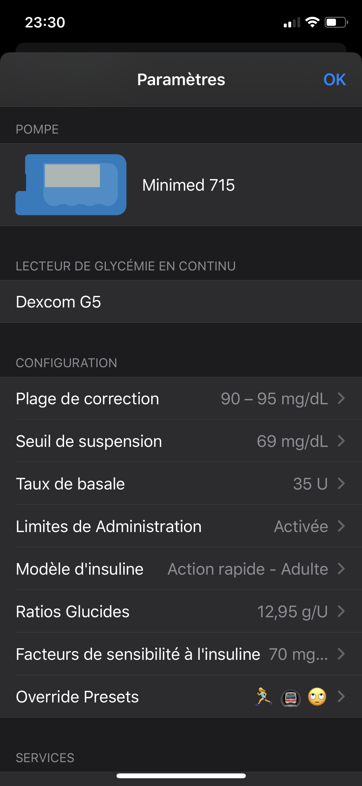
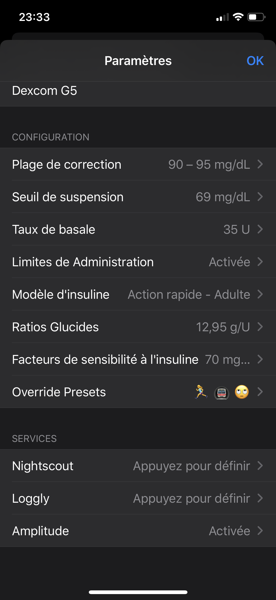

# Mise en place
## Comment mettre en place votre application Loop
Cette section des guides va vous montrer toutes les informations vitales à mettre dans Loop, et comment faire. Vous allez devoir effectuer ces étapes une par une, comme listé dans les sous-menus de cette section. Veuillez suivre attentivement pour vous assurez qu’il ne vous manque rien en terme de réglage, ainsi que les informations cruciales sur ce que chaque réglage fait.

## Ajouter la pompe
La première étape est de dire à Loop qu’elle pompe vous utilisez. Il y a deux pages séparées pour la mise en place d’une pompe Medtronic (MDT) ou une pompe Omnipod Eros (simplement "pod"). Veuillez cliquer ci-dessous pour trouver le guide de votre pompe.

## Ajouter le CGM
Vous allez devoir ajouter votre source de données CGM dans votre application Loop. Si vous vous demandez quels systèmes fonctionnent avec Loop, veuillez [vérifier ici](https://loopkit.github.io/loopdocs/build/step4/). Le guide pour ajouter son CGM [se trouve ici](https://loopkit.github.io/loopdocs/operation/loop-settings/cgm/).

## Configurations
Il y a une section dans votre menu de réglages qui s'appelle "Configuration". Sous cette section, vous allez entrer des réglages qui vous sont familier : 

* Taux de basale
* Ratios glucides
* Facteurs de sensibilité à l'insuline

Vous remarquerez qu'il y en a des nouveaux aussi, comme le modèle d'insuline, seuil de suspension et "override presets". Veuillez suivre le guide de mise en place [ici](https://loopkit.github.io/loopdocs/operation/loop-settings/configurations/).

## Services (falcultatif)
La dernière section sur cet écran, qui s'appelle [services](https://loopkit.github.io/loopdocs/operation/loop-settings/services), consiste en trois applications vers laquelle vous pouvez envoyer vos données de Loop. Le service le plus commun est Nightscout, mais Loggly et Amplitude peuvent recevoir des données relatives à vos erreurs de Loop. Ces services sont tous facultatifs. Leur non-application n'affecte point votre capacité d'utiliser Loop.

## Affichages de Loop
Une fois fini avec l'enregistrement de vos données, vous allez devoir vous familiariser avec les affichages de Loop. [Cette page](https://loopkit.github.io/loopdocs/operation/loop-settings/displays/) vous aidera dans le décryptage des icônes, graphiques et données que Loop vous affichera.

## Menu du RileyLink
Le RileyLink possède un menu juste pour lui. Il affiche des commandes que l'on peut utiliser et envoyer au RileyLink pour récupérer des informations et affecter des étapes de dépannage. Veuillez lire [cette page](https://loopkit.github.io/loopdocs/operation/loop-settings/rileylink) pour en savoir plus.
